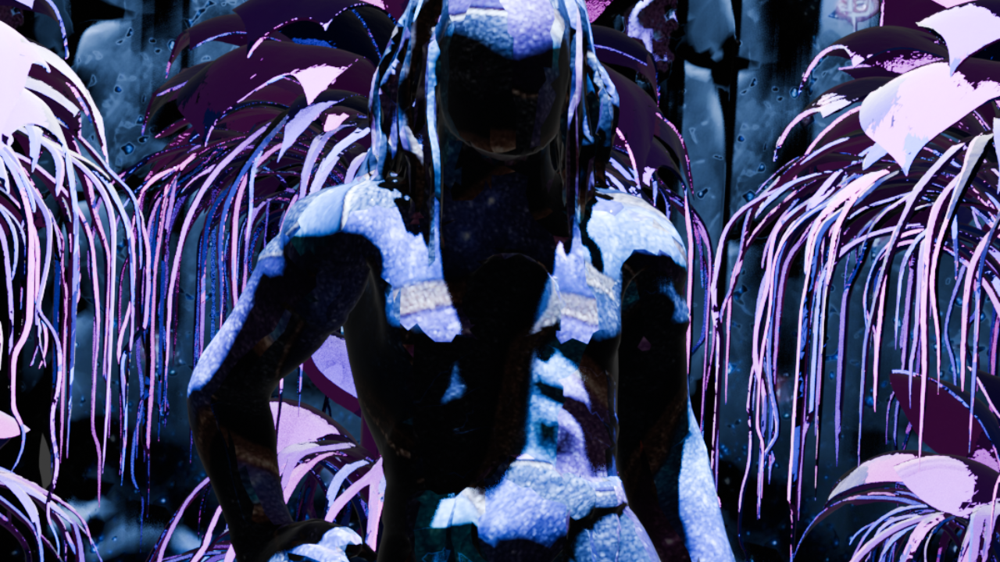

# AVALON 3D World Prototype

## Overview
11 Creatures (+1)  
8 Flora Assets  
16 Structures  
4 Characters (Rigged)  
4 Ambient Audio  
5 Tracks  
2 Vertical Sequences  
1 Font (Symbolic Script)  
1 Audio Web App

## Preview

## Access

Open for collaboration.

## Links

Website All Assets:  
https://sites.google.com/view/bune-3d/avalon

YouTube Showcase & Audio:  
https://www.youtube.com/playlist?list=PLo5fLmIgPY1xbgTmO_U7H2xPNpFe5glVE

Font:  
https://github.com/Bunesky/avalon-symbol-font

Web Audio Language App:
https://bunesky.github.io/avalon-symbol-audio/

Audio App (Source):
https://github.com/Bunesky/avalon-symbol-audio

## Notes
Avalon is an ongoing experimental project focused on building a complete 3D world through modular assets, visual systems, original audio, and its own symbolic language and writing system. All content has been created with the support of AI.

## Contact

Bluesky:  
https://bsky.app/profile/bune.bsky.social

