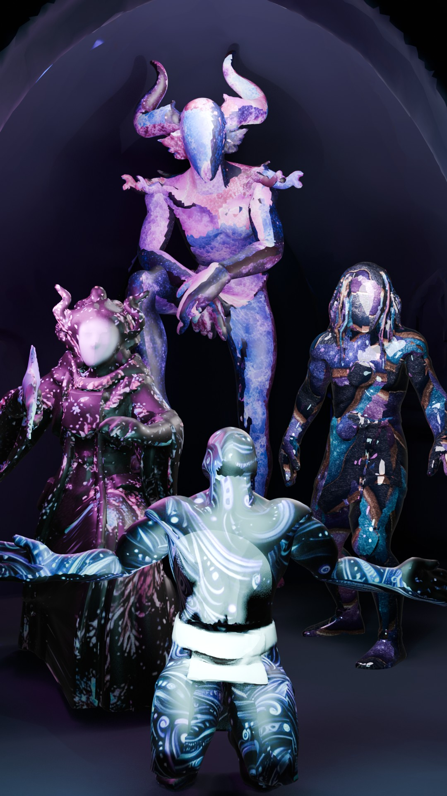

# AVALON 3D World Prototype

## Overview

11 Creatures (+1)  
8 Flora Assets  
16 Structures  
4 Characters (Rigged)  
4 Ambient Audio  
5 Tracks  
2 Vertical Sequences  
1 Font (Symbolic Script)
1 Audio Web App

## Preview

## Access

Assets available on request (free). Open for collaboration.

## Links

Website All Assets:  
https://sites.google.com/view/bune-3d/avalon

YouTube Showcase & Audio:  
https://www.youtube.com/playlist?list=PLo5fLmIgPY1xbgTmO_U7H2xPNpFe5glVE

Font:  
https://github.com/Bunesky/avalon-symbol-font

Live Audio App:
https://bunesky.github.io/avalon-symbol-audio/

Source Code:
https://github.com/Bunesky/avalon-symbol-audio

## Notes

Avalon is an ongoing experimental project focused on building a complete world through modular assets and visual systems, created using AI-assisted workflows.

## Contact

Bluesky:  
https://bsky.app/profile/bune.bsky.social

