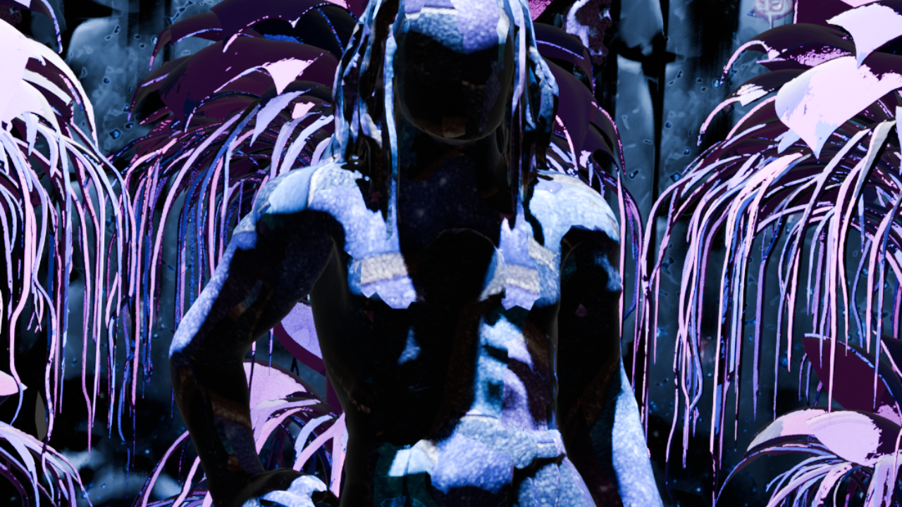

# AVALON 3D World Prototype

## Overview
11 Creatures (+1)  
8 Flora Assets  
16 Structures  
4 Animated Characters   
4 Ambient Audio  
5 Tracks  
2 Vertical Sequences  
1 Font (Symbolic Script)  
1 Audio Language Web App

1 Playable 3D Game (Character Showcase)

## Links

Website All Assets:  
https://sites.google.com/view/bune-3d/avalon

YouTube Showcase & Audio:  
https://www.youtube.com/playlist?list=PLo5fLmIgPY1xbgTmO_U7H2xPNpFe5glVE

Font:  
https://youtube.com/shorts/wGobCoHXBcc

Web audio language app:  
https://youtube.com/shorts/hp2eKLnb-mk

Game (Character Showcase)
https://bunesky.itch.io/avalon

## Notes
Avalon is an ongoing experimental project focused on building a complete 3D world through modular assets, animated Characters visual systems, original audio, and its own symbolic language and writing system. All content has been created with the support of AI. 

## Contact

Bluesky:  
https://bsky.app/profile/bune.bsky.social

